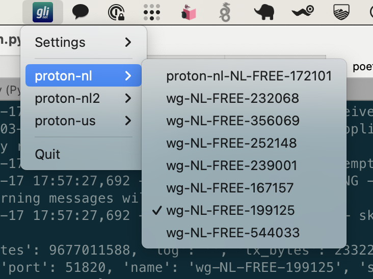

# Glinet wireguard menubar app

This is a very simple macos menubar app that allows you to quickly switch wireguard peers. This was developed so I could switch between free vpn setups I had available when a vpn server was over capacity

## Table of Contents

- [Glinet wireguard menubar app](#glinet-wireguard-menubar-app)
  - [Table of Contents](#table-of-contents)
  - [Installation](#installation)
  - [Usage](#usage)
  - [Contributing](#contributing)
  - [License](#license)

## Installation

I used [poetry](https://python-poetry.org/) to setup this app. The main dependency is a fork of [python-glinet](https://github.com/tomtana/python-glinet) that fixes some initialization issues. Setup your poetry venv and run poetry install.

## Usage

You can run the app after installing the dependencies by running `python main.py`

## Contributing

Feel free to report issues and send PRs. 

## License

MIT license
